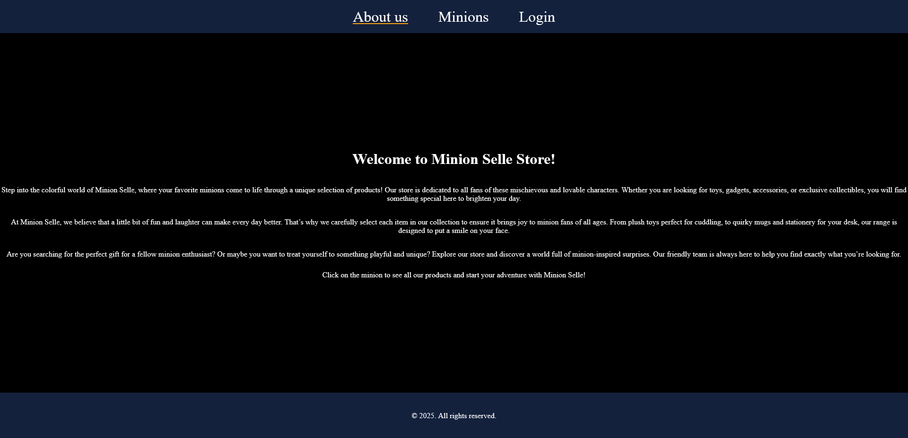
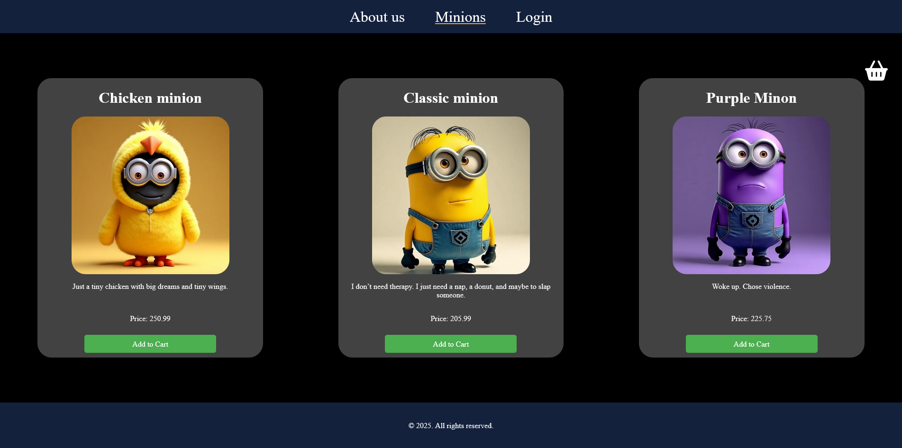
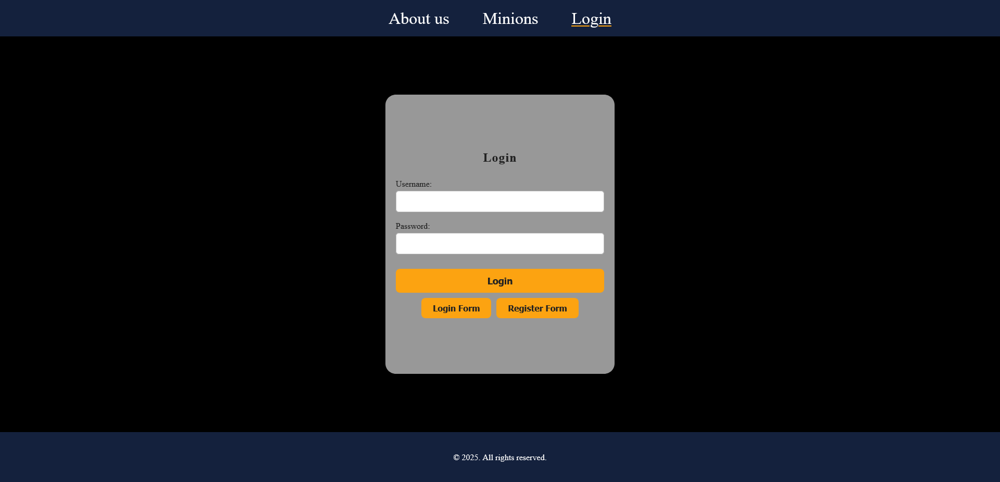
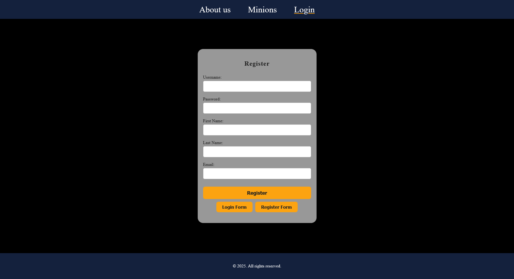
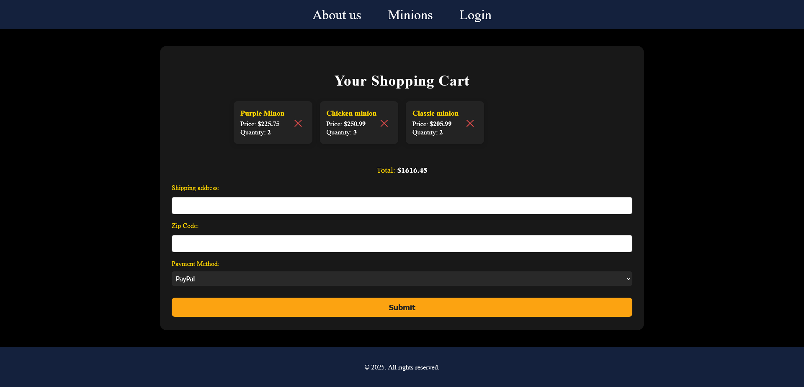
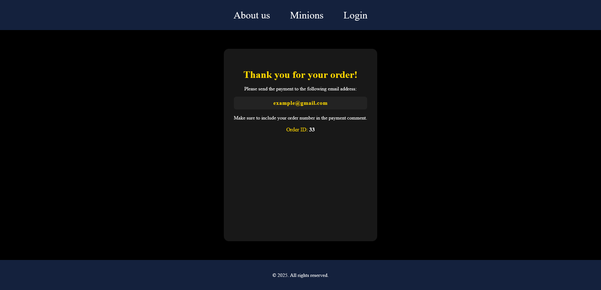

# 🛍️ Minion Shop
📦 To install project dependencies, run:
pip install -r requirements.txt  

➡️ To add example products to your database, see the [Add Products to the Database](#️-add-products-to-the-database) section below.

---
## 🟡 Landing Page  
This is the page the user sees immediately upon entering the shop:



---

## 🧸 Product Page  
When the user clicks on **Minions**, they will see the product list:



---

## 🛒 Add to Cart & Login  
When the user clicks the **"Add to cart"** button, the product will be added to the cart.  
However, they won’t be able to proceed to checkout without logging in first.  
They will be automatically redirected to the login or account creation page.

### 🔐 Login Page  


### 📝 Register Page  


---

## 📦 Checkout Process  
Upon re-entering the cart, the user will be able to proceed to the checkout page.  
They will be required to:

- Enter their **shipping address**
- Provide their **ZIP code**
- Choose a **payment method**

After completing these steps, they will be redirected to a page with **bank transfer details**.



---

## ✅ Order Confirmation  
When everything is correctly filled out, the user will see a success confirmation page:



---

## 🗄️ Add Products to the Database

Make sure your database (`db.sqlite3`) exists.  
If not, run:

```
python manage.py migrate
```

To add example products, open the Django shell:

```
python manage.py shell
```

Then paste:

```python
from Products.models import Product

products = [
    {"name": "Chicken Minion", "description": "Chicken-shaped Minion toy.", "price": 19.99, "stock": 10, "image": "products/chicken_minion.png"},
    {"name": "Classic Minion", "description": "Classic Minion, ready for adventure.", "price": 17.99, "stock": 15, "image": "products/classic_minion.png"},
    {"name": "Purple Minion", "description": "Wild Purple Minion, full of mischief.", "price": 21.99, "stock": 8, "image": "products/purple_minion.png"},
]

for p in products:
    Product.objects.create(**p)
```

Make sure the images are in `media/products/`.